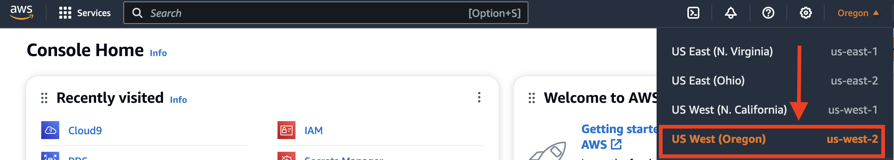
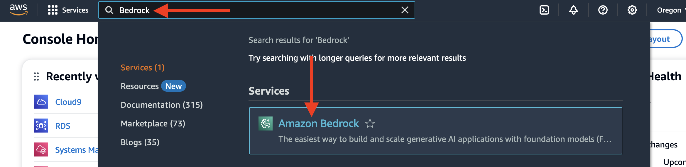
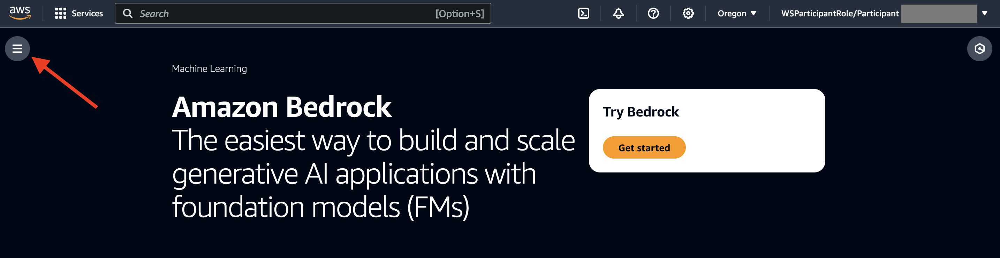
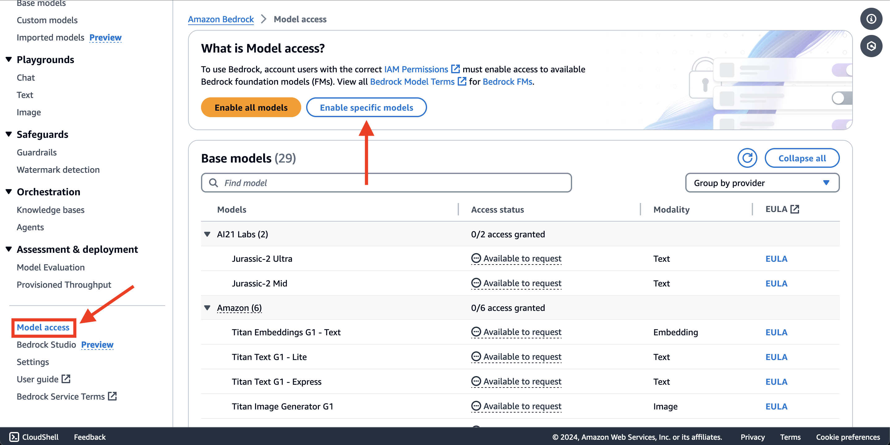
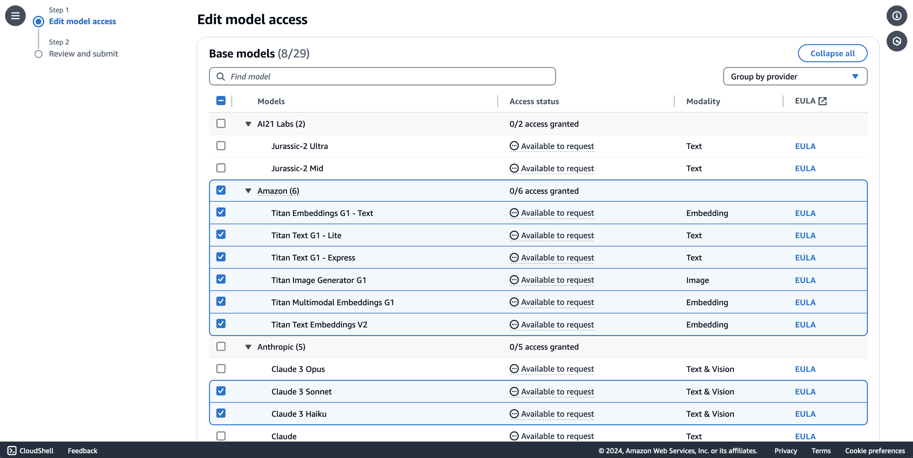
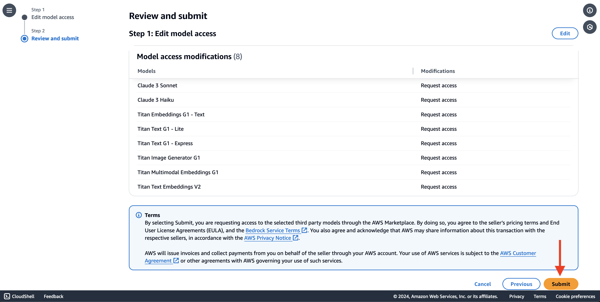
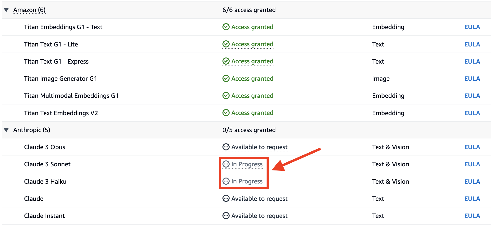
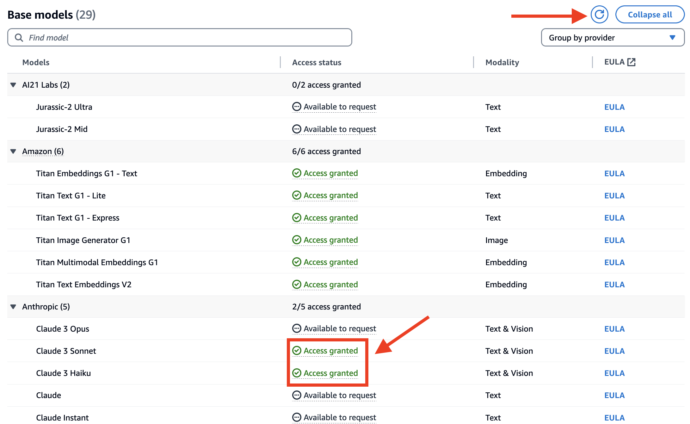

# Guidance for High Speed Retrieval Augmented Generation (RAG) chatbots on AWS.


1. [Overview](#overview)
    - [Architecture](#architecture)
    - [Cost](#cost)
2. [Prerequisites](#prerequisites)
    - [Operating System](#operating-system)
3. [Deployment Steps](#deployment-steps)
4. [Running the Guidance](#running-the-guidance)
5. [Next Steps](#next-steps)
6. [Cleanup](#cleanup)
7. [Notices](#notices)
8. [Known Issues](#known-issues)
9. [Authors](#authors)

## Overview
Generative AI – a category of artificial intelligence algorithms that can generate new content based on existing data — has been hailed as the next frontier for various industries, from tech to financial services, e-commerce and healthcare. The driving force behind the capabilities of generative AI chatbots lies in their foundation models. These models consist of expansive neural networks meticulously trained on vast amounts of unstructured, unlabeled data spanning various formats, including text and audio. The versatility of foundation models enables their utilization across a wide range of tasks, showcasing their limitless potential. In this Guidance, we will build an AI chatbot using Amazon Aurora PostgreSQL-Compatible Edition with pgvector enabled as the vector store. You can create an enterprise ready RAG application using a combination of different services including Amazon Bedrock, Amazon Aurora with pgvector as vector database, open-source frameworks such as LangChain for interacting with all the components and Streamlit for building chatbot frontend.

In this guidance, we provide a step-by-step guide with all the building blocks for creating an enterprise ready RAG application such as a question answering chatbot. We use a combination of different AWS services including [Amazon Bedrock](https://aws.amazon.com/bedrock/), an easy way to build and scale generative AI applications with foundation models. We use [Titan Text](https://aws.amazon.com/bedrock/titan/) for text embeddings and [Anthropic's Claude on Amazon Bedrock](https://aws.amazon.com/bedrock/claude/) as our LLM and the pgvector extension on Amazon Aurora PostgreSQL-Compatible Edition as our vector database. We also demonstrate integration with open-source frameworks such as LangChain for interfacing with all the components and Streamlit for building the chatbot frontend.

### Architecture


### How It Works

The application follows these steps to provide responses to your questions:

1. **PDF Loading**: The app reads PDF documents and extracts their text content.

2. **Text Chunking**: The extracted text is divided into smaller chunks that can be processed effectively.

3. **Embedding**: The application utilizes Titan Text from Amazon Bedrock to generate vector representations (embeddings) of the text chunks.

4. **User Question**: The user asks a question in natural language. 

5. **Similarity Matching**: When the user asks a question, the app compares it with the text chunks and identifies the most semantically similar ones.

6. **RAG**: The user question and the context from the vector database is passed to the LLM (Anthropic's Claude on Amazon Bedrock).

7. **Response Generation**: The LLM generates a response based on the relevant content of the PDFs.

### Cost

_You are responsible for the cost of the AWS services used while running this Guidance. We recommend creating a [Budget](https://docs.aws.amazon.com/cost-management/latest/userguide/budgets-managing-costs.html) through [AWS Cost Explorer](https://aws.amazon.com/aws-cost-management/aws-cost-explorer/) to help manage costs. Prices are subject to change. For full details, refer to the pricing webpage for each AWS service used in this Guidance._

### Sample Cost Table

The following table provides a sample cost breakdown for deploying this Guidance with the default parameters in the US West (Oregon) Region.

| AWS service  | Price per 1000 input tokens [USD] | Price per 1000 input tokens [USD] |
| ------------ | ----------------------------------| --------------------------------- |
| Amazon Bedrock - Titan Text Embeddings model | $ 0.0001  | n/a |
| Amazon Bedrock - Claude 3 Sonnet | $ 0.00300 | $ 0.01500 |

| AWS service  | Instance type | Standard Price per hour [USD] |
| ----------- | ------------ | ------------ |
| Amazon Aurora | db.r6g.2xlarge  | $1.038 |

## Prerequisites

1. [Amazon Bedrock](https://aws.amazon.com/bedrock/) requires you to request access to its foundational models as a pre-requisite before you can start invoking the model using Bedrock APIs.Below we will configure [model access](https://docs.aws.amazon.com/bedrock/latest/userguide/model-access.html) in Amazon Bedrock in order to build and run generative AI applications. Amazon Bedrock provides a variety of foundation models from several providers such as AI21 Labs, Anthropic, Cohere, Meta, Stability AI, and Amazon.

#### Amazon Bedrock Setup Instructions
- In the [AWS Console](https://aws.amazon.com/console/), select the Region from which you want to access Amazon Bedrock.
- For this guidance , we will be using the `us-west-2` region.
  

- Search for Amazon Bedrock by typing in the search bar on the AWS console.
  

- Expand the side menu with three horizontal lines (as shown below), select Model access and click on Enable specific models button.
  
  

- For this guidance, we'll be using Anthropic's Claude 3 models as LLMs and Amazon Titan family of embedding models. Click Next in the bottom right corner to review and submit.
  
  
  
- You will be granted access to Amazon Titan models instantly. The Access status column will change to In progress for Anthropic Claude 3 momentarily. Keep reviewing the Access status column. You may need to refresh the page periodically. You should see Access granted shortly (wait time is typically 1-3 mins).
  
  

> [!Note]
> Now you have successfully configured Amazon Bedrock.

2. We recommend using Mozilla Firefox as the preferred browser for running the AWS Cloud9 Console. If you don't already have it, you can download it from [Mozilla Firefox](https://www.mozilla.org/en-US/firefox/new/).


### Operating System
In this sample code deployment we are using Linux operating system for Cloud9 EC2 instance and Amazon Aurora Postgresql instance.

## Deployment Steps

#### 1. Clone the GitHub repository to access the AWS CFN deployment template.

    ```
    git clone https://github.com/aws-solutions-library-samples/guidance-for-high-speed-rag-chatbots-on-aws.git
    cd ./guidance-for-high-speed-rag-chatbots-on-aws
    ```
#### 2. Deploy the AWS CloudFormation Stack
This guidance utilizes the `AdministratorAccess` role for deployment. For use in a production environment, refer to the [security best practices](https://docs.aws.amazon.com/IAM/latest/UserGuide/best-practices.html) in the AWS Identity and Access Management (IAM) documentation and modify the IAM roles, Amazon Aurora, and other services used as needed.

* Using the AWS Management Console

    * Sign in to the [AWS CloudFormation console](https://console.aws.amazon.com/cloudformation/home)
    * Create Stack > Upload the `guidance-for-high-speed-rag-chatbots-on-aws/source/templates/prereq-rag-chatbots-on-aws.yml` file
    * Deploy the stack after entering `rag-chatbots` in the stack name
        * The parameters can be changed, but we recommend the default values for a smooth deployment.
     
#### 3. Deployment Validation

Open the AWS CloudFormation console and verify the status of the stack deployment with the name starting with `rag-chatbots`.

Deploying this stack automatically creates the following resources:

- **VPC, Subnet, Internet Gateway, Security Groups, Route Table:** A VPC with public and private subnets, an internet gateway for public access, and Secrutiy Groups & Route Table for access control.
- **Amazon Aurora PostgreSQL cluster:** An Amazon Aurora PostgreSQL cluster consisting of a provisioned writer instance, a provisioned reader instance
- **AWS Cloud9 IDE** AWS Cloud9 is a cloud-based integrated development environment (IDE) that lets you write, run, and debug your code with just a browser.
- **AWS Secrets Manager , AWS Key Management Service:** AWS Secrets Manager helps you manage, retrieve database credentials and AWS Key Management Service to encrypt the database cluster.
- **AWS Identity and Access Management - IAM Roles:** IAM Roles defined with a set of permissions, allowing them to perform actions on AWS resources deployed in this guidance.
- **Amazon S3 Bucket:**Amazon Simple Storage Service (Amazon S3) is an object storage service to store and retrieve any amount of data at any time, from anywhere.
- **[Optional] - You can see the detailed output in the AWS CloudFormation Stack `rag-chabots` using below AWS CLI command.**

    ```
    aws cloudformation describe-stacks --stack-name rag-chatbots --query 'Stacks[0].Outputs' --output table --no-cli-pager
    ```
    
## Running the Guidance
#### 1. Setup the environment in AWS Cloud9 to connect to Aurora PostgreSQL DB Cluster

- Navigate to the [AWS Cloud9 Console](https://console.aws.amazon.com/cloud9/home). You will see a Cloud9 Environment created by CloudFormation Stack with name `genai-pgvector-rag-chatbots-Cloud9-IDE`. Click on `Open`, a Cloud9 Environment will load and you will see Welcome page. Within the Cloud9 IDE, click on Window in the Top Menu and then Click on **New Terminal**
- Use the code block below to setup the environment (use the Copy button on the right to copy code and paste it on the AWS Cloud9 Terminal)

     ```bash 
    # Update the AWS CLI v2
    sudo rm -rf /usr/local/aws
    sudo rm /usr/bin/aws
    curl "https://awscli.amazonaws.com/awscli-exe-linux-x86_64.zip" -o "awscliv2.zip"
    unzip awscliv2.zip
    sudo ./aws/install
    rm awscliv2.zip
 
    # Install Python 3.11
    sudo yum remove -y openssl-devel
    sudo yum install -y gcc openssl11-devel bzip2-devel libffi-devel 
    cd /opt
    sudo wget https://www.python.org/ftp/python/3.11.9/Python-3.11.9.tgz 
    sudo tar xzf Python-3.11.9.tgz
    cd Python-3.11.9
    sudo ./configure --enable-optimizations 
    sudo make altinstall
    sudo rm -f /opt/Python-3.11.9.tgz
    pip install --upgrade pip
     
    # Clone the GitHub repository to your AWS Cloud9 IDE:
    git clone https://github.com/aws-solutions-library-samples/guidance-for-high-speed-rag-chatbots-on-aws.git
    cd ~/environment/guidance-for-high-speed-rag-chatbots-on-aws/source/01_RetrievalAugmentedGeneration/01_QuestionAnswering_Bedrock_LLMs

    # The requirements.txt file has all the required libraries you need to install for building the QnA chatbot application
    python3.11 -m pip install -r requirements.txt 
     
    # Install JQuery for parsing output
    sudo yum install -y jq
    
    # Install PostgreSQL 14 client and related utilities
    sudo amazon-linux-extras install -y postgresql14
    sudo yum install -y postgresql-contrib sysbench
    
    # Setup your environment variables to connect to Aurora PostgreSQL
    AWSREGION=`aws configure get region`
    
    PGHOST=`aws rds describe-db-cluster-endpoints \
        --db-cluster-identifier apgpg-pgvector \
        --region $AWSREGION \
        --query 'DBClusterEndpoints[0].Endpoint' \
        --output text`
    
    # Retrieve credentials from Secrets Manager - Secret: apgpg-pgvector-secret
    CREDS=`aws secretsmanager get-secret-value \
        --secret-id apgpg-pgvector-secret \
        --region $AWSREGION | jq -r '.SecretString'`
    
    export PGUSER="`echo $CREDS | jq -r '.username'`"
    export PGPASSWORD="`echo $CREDS | jq -r '.password'`"    
    export PGHOST
    export PGDATABASE=postgres
    export PGPORT=5432
    export AWSREGION
    
    # Persist values in future terminals
    echo "export PGUSER=$PGUSER" >> /home/ec2-user/.bashrc
    echo "export PGPASSWORD='$PGPASSWORD'" >> /home/ec2-user/.bashrc
    echo "export PGHOST=$PGHOST" >> /home/ec2-user/.bashrc
    echo "export PGPORT=5432" >> /home/ec2-user/.bashrc
    echo "export PGDATABASE=postgres" >> /home/ec2-user/.bashrc
    echo "export AWSREGION=$AWSREGION" >> /home/ec2-user/.bashrc


    # Create pgvector extension
    psql -c "CREATE EXTENSION IF NOT EXISTS vector;"

    # create an .env file for your project
    cd ~/environment/guidance-for-high-speed-rag-chatbots-on-aws/source/01_RetrievalAugmentedGeneration/01_QuestionAnswering_Bedrock_LLMs
    cat > .env << EOF
    PGVECTOR_USER='$PGUSER'
    PGVECTOR_PASSWORD='$PGPASSWORD'
    PGVECTOR_HOST='$PGHOST'
    PGVECTOR_PORT=$PGPORT
    PGVECTOR_DATABASE='$PGDATABASE'
    EOF
    
    cat .env 
    ```
     
    Your .env file should like the following:

    ```
    PGVECTOR_USER=<username>
    PGVECTOR_PASSWORD=<password>
    PGVECTOR_HOST=<Aurora DB endpoint>
    PGVECTOR_PORT=5432
    PGVECTOR_DATABASE=<dbname>
    ```


#### Running the Streamlit Application as Chatbot

Now that you have successfully written code for your generative AI chatbot application, it’s time to run the application via Streamlit.

1. Navigate to the folder `/source/01_RetrievalAugmentedGeneration/01_QuestionAnswering_Bedrock_LLMs`

Run the following command:
```
streamlit run app.py --server.port 8080
```
2. If the command is successful, your output screen will look like below (note: we are using AWS Cloud9 terminal):

   

3. In Cloud9, you are able to preview a running application from within the IDE. Choose Preview -> Preview Running Application from the menu bar:

   

4. The Preview screen appears as follows:

   

5. Follow the instructions in the sidebar:

    a. Browse and upload PDF files. You can upload multiple PDFs because we set the parameter accept_multiple_files=True for the file_uploader function.
   
    b. Let’s upload a PDF – [Amazon Aurora FAQs](https://github.com/aws-solutions-library-samples/guidance-for-high-speed-rag-chatbots-on-aws/blob/main/source/01_RetrievalAugmentedGeneration/01_QuestionAnswering_Bedrock_LLMs/data/Amazon%20Aurora%20FAQs.pdf). Download/save this file and upload it to your Streamlit application by clicking Browse files. Once you’ve uploaded the file, click Process. Once the PDF is uploaded successfully, you will see a PDF uploaded successfully.

   

   

6. Start asking your questions in the text input box. For example, let’s start with a simple question – What is Amazon Aurora?

   

7. Let’s ask a different question, a bit more complex – What does "three times the performance of PostgreSQL" mean?

> [!NOTE] 
> you may either see a similar or a slightly different response:

   

Note here that without specifying the keyword “Aurora”, our generative AI app took the context from the previous question and inferred that the question was in fact about Amazon Aurora PostgreSQL-Compatible Edition. This is because the chat/conversation history is preserved due to LangChain’s ConversationSummaryBufferMemory. Also, ConversationalRetrievalChain allows you to set up a chain with chat history for follow-up questions.

8. With Streamlit, you can also upload multiple files as sources and ask questions from any of those sources. But before we upload our new file, let’s ask a question for which our LLM doesn’t have any context yet – What is Amazon Bedrock?

Note the response (you may either see a similar or a slightly different response):

   

9. Now, let’s upload another file [Amazon Bedrock FAQs](https://ws-assets-prod-iad-r-pdx-f3b3f9f1a7d6a3d0.s3.us-west-2.amazonaws.com/1b65c05a-7ca9-474d-b6a7-4471e489c569/Amazon%20Bedrock%20FAQs.pdf). Download/save this file, click Browse files to upload this file and then click Process. Once the PDF is uploaded successfully, you will see a PDF uploaded successfully

Now, let’s ask our chatbot the previous question. A response similar to the following is generated:

   
   
10. Try out some more questions and see the results:

        1.Which FMs are available on Amazon Bedrock?

        2.Why should I use Amazon Bedrock?
    
        3.What are agents for Amazon Bedrock?
    
        4.How can I connect FMs to my company data sources?
    
        5.How can I securely use my data to customize FMs available through Amazon Bedrock?

## Next Steps

In this Guidance we are using Amazon Titan text embedding model to generate embeddings. You can also try with other LLM models that are supported on Amazon Bedrock. Refer to these additional blog posts for more details.

[Leverage pgvector and Amazon Aurora PostgreSQL for Natural Language Processing, Chatbots and Sentiment Analysis](https://aws.amazon.com/blogs/database/leverage-pgvector-and-amazon-aurora-postgresql-for-natural-language-processing-chatbots-and-sentiment-analysis/)

[Build generative AI applications with Amazon Aurora and Knowledge Bases for Amazon Bedrock](https://aws.amazon.com/blogs/database/build-generative-ai-applications-with-amazon-aurora-and-knowledge-bases-for-amazon-bedrock/)

## Cleanup

This Guidance requires manual deletion of resources created as part of this guidance. If AWS Cloud9 instance and Amazon Aurora DB Cluster were newly created following the steps per this guidance, then those have to be manually deleted when no longer required. 

## Notices

*Customers are responsible for making their own independent assessment of the information in this Guidance. This Guidance: (a) is for informational purposes only, (b) represents AWS current product offerings and practices, which are subject to change without notice, and (c) does not create any commitments or assurances from AWS and its affiliates, suppliers or licensors. AWS products or services are provided “as is” without warranties, representations, or conditions of any kind, whether express or implied. AWS responsibilities and liabilities to its customers are controlled by AWS agreements, and this Guidance is not part of, nor does it modify, any agreement between AWS and its customers.*

## Known Issues
> [!Warning]
> Encountering AxiosError: Request failed with status code 403? --> Check your Streamlit version in terminal with the command pip show streamlit. It should be 1.24.0.Ensure you're using Mozilla Firefox as your browser. This issue is more common if you're using Google Chrome.
 
### License

The GenAI Q&A Chatbot with pgvector and Amazon Aurora PostgreSQL-compatible edition application is released under the [MIT-0 License](https://spdx.org/licenses/MIT-0.html).

## Authors
- Shayon Sanyal
- Krishna Sarabu
- Raj Jayakrishnan
- Sharath Chandra Kampili
- Yamuna Palasamudram

### Contribution
This repository is intended for educational purposes and does not accept further contributions. Feel free to utilize and enhance the app based on your own requirements.
    

