# Guidance for High Speed Retrieval Augmented Generation (RAG) chatbots on AWS.


1. [Overview](#overview)
    - [Architecture](#architecture)
    - [Cost](#cost)
2. [Prerequisites](#prerequisites)
    - [Operating System](#operating-system)
3. [Deployment Steps](#deployment-steps)
4. [Deployment Validation](#running-the-guidance)
5. [Running the Guidance](#running-the-guidance)
6. [Next Steps](#next-steps)
7. [Cleanup](#cleanup)
8. [Notices](#notices)
9. [Authors](#authors)

## Overview
Generative AI – a category of artificial intelligence algorithms that can generate new content based on existing data — has been hailed as the next frontier for various industries, from tech to financial services, e-commerce and healthcare. The driving force behind the capabilities of generative AI chatbots lies in their foundation models. These models consist of expansive neural networks meticulously trained on vast amounts of unstructured, unlabeled data spanning various formats, including text and audio. The versatility of foundation models enables their utilization across a wide range of tasks, showcasing their limitless potential. In this Guidance, we will build an AI chatbot using Amazon Aurora PostgreSQL-Compatible Edition with pgvector enabled as the vector store. You can create an enterprise ready RAG application using a combination of different services including Amazon Bedrock, Amazon Aurora with pgvector as vector database, open-source frameworks such as LangChain for interacting with all the components and Streamlit for building chatbot frontend.

In this guidance, we provide a step-by-step guide with all the building blocks for creating an enterprise ready RAG application such as a question answering chatbot. We use a combination of different AWS services including [Amazon Bedrock](https://aws.amazon.com/bedrock/), an easy way to build and scale generative AI applications with foundation models. We use [Titan Text](https://aws.amazon.com/bedrock/titan/) for text embeddings and [Anthropic's Claude on Amazon Bedrock](https://aws.amazon.com/bedrock/claude/) as our LLM and the pgvector extension on Amazon Aurora PostgreSQL-Compatible Edition as our vector database. We also demonstrate integration with open-source frameworks such as LangChain for interfacing with all the components and Streamlit for building the chatbot frontend.

### Architecture


### How It Works

The application follows these steps to provide responses to your questions:

1. **PDF Loading**: The app reads PDF documents and extracts their text content.

2. **Text Chunking**: The extracted text is divided into smaller chunks that can be processed effectively.

3. **Embedding**: The application utilizes Titan Text from Amazon Bedrock to generate vector representations (embeddings) of the text chunks.

4. **User Question**: The user asks a question in natural language. 

5. **Similarity Matching**: When the user asks a question, the app compares it with the text chunks and identifies the most semantically similar ones.

6. **RAG**: The user question and the context from the vector database is passed to the LLM (Anthropic's Claude on Amazon Bedrock).

7. **Response Generation**: The LLM generates a response based on the relevant content of the PDFs.

### Cost

_You are responsible for the cost of the AWS services used while running this Guidance. We recommend creating a [Budget](https://docs.aws.amazon.com/cost-management/latest/userguide/budgets-managing-costs.html) through [AWS Cost Explorer](https://aws.amazon.com/aws-cost-management/aws-cost-explorer/) to help manage costs. Prices are subject to change. For full details, refer to the pricing webpage for each AWS service used in this Guidance._

### Sample Cost Table

The following table provides a sample cost breakdown for deploying this Guidance with the default parameters in the US West (Oregon) Region.

| AWS service  | Price per 1000 input tokens [USD] | Price per 1000 input tokens [USD] |
| ----------- | ------------ | ------------ |
| Amazon Bedrock - Titan Text Embeddings model | $ 0.0001  | n/a |
| Amazon Bedrock - Claude 3 Sonnet | $ 0.00300 | $ 0.01500 |

| AWS service  | Instance type | Standard Price per hour [USD] |
| ----------- | ------------ | ------------ |
| Amazon Aurora | db.r6g.2xlarge  | $1.038 |

## Prerequisites

1. An [Aurora PostgreSQL-Compatible Edition DB cluster](https://docs.aws.amazon.com/AmazonRDS/latest/AuroraUserGuide/CHAP_GettingStartedAurora.CreatingConnecting.AuroraPostgreSQL.html) with [pgvector](https://aws.amazon.com/about-aws/whats-new/2023/07/amazon-aurora-postgresql-pgvector-vector-storage-similarity-search/) support.
2. Access to [Amazon Bedrock foundation models](https://docs.aws.amazon.com/bedrock/latest/userguide/model-access.html) – Amazon Titan and Anthropic Claude.
3. We recommend using [AWS Cloud9](https://aws.amazon.com/cloud9/) to connect to the Aurora PostgreSQL DB cluster for these guidance without the need to open inbound ports, maintain bastion hosts, or manage SSH keys. We also recommend using Mozilla Firefox as the preferred browser for all labs. If you don't already have it, you can download it from [Mozilla Firefox](https://www.mozilla.org/en-US/firefox/new/).
4. [Install Python](https://docs.aws.amazon.com/cloud9/latest/user-guide/sample-python.html) with the required dependencies (in this post, we use Python v3.9). You can deploy this solution locally on your laptop or via Amazon SageMaker Notebooks.

### Operating System
In this sample code deployment we are using Linux operating system for Cloud9 EC2 instance and Amazon Aurora Postgresql instance.

### Environment setup

1. Clone the GitHub repository to your local machine:
    ```
    git clone https://github.com/aws-solutions-library-samples/guidance-for-high-speed-rag-chatbots-on-aws.git
    ```
   
2. Navigate to source/01_RetrievalAugmentedGeneration/01_QuestionAnswering_Bedrock_LLMs folder in terminal of your choice:

    ```
    cd /source/01_RetrievalAugmentedGeneration/01_QuestionAnswering_Bedrock_LLMs 
    ```

3. Create a .env file in your project directory to add your Aurora PostgreSQL DB cluster details. Your .env file should like the following:

    ```
    PGVECTOR_DRIVER='psycopg2'
    PGVECTOR_USER='<<Username>>'
    PGVECTOR_PASSWORD='<<Password>>'
    PGVECTOR_HOST='<<Aurora DB cluster host>>'
    PGVECTOR_PORT=5432
    PGVECTOR_DATABASE='<<DBName>>'
    ```

4. The GitHub repository you cloned earlier includes a file requirements.txt which has all the required libraries you need to install for building the QnA chatbot application. Install the libraries by running the following commands:
    ```
    pip3.9 install -r requirements.txt
    ```

5. Update the AWS CLI and Install PostgreSQL to establish connectivity to Aurora using AWS Cloud9 IDE.
    ```
    # Update the AWS CLI v2
    sudo rm -rf /usr/local/aws
    sudo rm /usr/bin/aws
    curl "https://awscli.amazonaws.com/awscli-exe-linux-x86_64.zip" -o "awscliv2.zip"
    unzip awscliv2.zip
    sudo ./aws/install
    rm awscliv2.zip

    # Install JQuery for parsing output
    sudo yum install -y jq

    # Install PostgreSQL 14 client and related utilities
    sudo amazon-linux-extras install -y postgresql14
    sudo yum install -y postgresql-contrib sysbench
    ```

    [Connect to deployed Aurora PostgreSQL cluster](https://docs.aws.amazon.com/AmazonRDS/latest/AuroraUserGuide/babelfish-connect-PostgreSQL.html) and create the below extension using psql.
    ```
    psql
    CREATE EXTENSION vector;
    \q
    ```

## Deployment Steps

To use the GenAI Q&A with pgvector and Amazon Aurora PostgreSQL App, follow these steps:

1. Ensure that you have installed the required dependencies and have access to Amazon Bedrock models that you wish to use.

2. Ensure that you have added Aurora PostgreSQL DB details to the `.env` file.

3. Ensure you have installed the extension `pgvector` on your Aurora PostgreSQL DB cluster:


### Build Streamlit application

This guide will walk you through each step to understand and run the code provided in the file /source/01_RetrievalAugmentedGeneration/01_QuestionAnswering_Bedrock_LLMs/rag_app.py. Follow the instructions below to run the script successfully. 

#Steps:

1. Navigate to python file /source/01_RetrievalAugmentedGeneration/01_QuestionAnswering_Bedrock_LLMs/ in the Cloud9 IDE window on the left, and and double-click to open the file rag_app.py in a new tab.

2. Import libraries

Let’s begin by importing the necessary libraries:

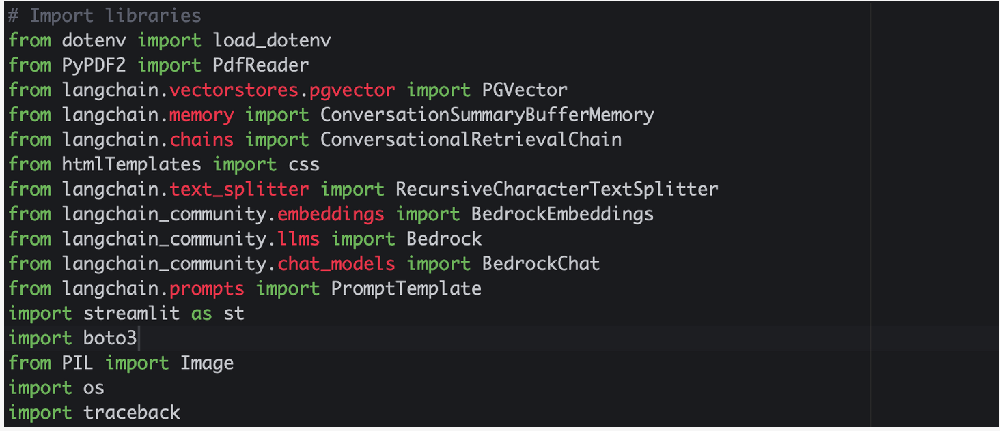

> [!Note]
> Next, you will find a series of placeholders separated by # TODO comments. Go through the remaining steps in the lab by filling in the correct code blocks in those placeholders (use the Copy button on the right to copy code).

2. Take PDFs as input and extract text

This function takes a list of PDF documents as input and extracts the text from them using PdfReader. It concatenates the extracted text and returns it.

```
def get_pdf_text(pdf_docs):
    text = ""
    for pdf in pdf_docs:
        pdf_reader = PdfReader(pdf)
        for page in pdf_reader.pages:
            text += page.extract_text()
    return text
```

3. Split PDF(s) into chunks

Given the extracted text, this function splits it into smaller chunks using LangChain’s RecursiveCharacterTextSplitter module. The chunk size, overlap, and other parameters are configured to optimize processing efficiency.
```
def get_text_chunks(text):
    text_splitter = RecursiveCharacterTextSplitter(
        separators=["\n\n", "\n", ".", " "],
        chunk_size=1000, 
        chunk_overlap=200, 
        length_function=len
     )

    chunks = text_splitter.split_text(text)
    return chunks
```

4. Load vector embeddings into Amazon Aurora PostgreSQL

Next, you will load the vector embeddings using Amazon Bedrock’s Embedding model amazon.titan-embed-text-v1 into an Aurora PostgreSQL DB cluster as the vector database. This function takes the text chunks as input and creates a vector store using Bedrock Embeddings (Titan) and pgvector. Aurora PostgreSQL with the pgvector extension stores the vector representations of the text chunks, enabling efficient retrieval based on semantic similarity.

```
def get_vectorstore(text_chunks):
    # Create the Titan embeddings
    embeddings = BedrockEmbeddings(model_id= "amazon.titan-embed-text-v2:0", client=BEDROCK_CLIENT)
    if text_chunks is None:
        return PGVector(
            connection=connection,
            embeddings=embeddings,
            use_jsonb=True
        )
    return PGVector.from_texts(texts=text_chunks, embedding=embeddings, connection=connection)
```

> [!Important]
> PGVector needs the connection string to the database. You can create it from environment variables as shown in the screenshot below: For this lab, scroll down to the main function to find this code, and fill in the values for your Aurora PostgreSQL DB connection. 

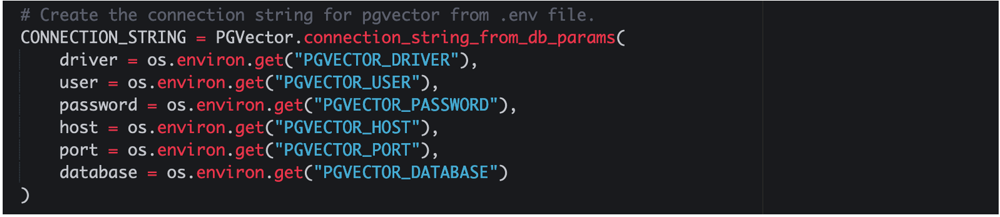

5. Create a Conversational Chain

In this function, a conversation chain is created using the conversational AI model (Anthropic’s Claude 3 Sonnet v1.0), vector store (created in the previous function), and conversation memory ConversationSummaryBufferMemory. This chain allows the generative AI application to engage in conversational interactions.
```
def get_conversation_chain(vectorstore):
    # Define model_id, client and model keyword arguments for Anthropic Claude 3 Sonnet v1.0
    llm = Bedrock(model_id="anthropic.claude-3-sonnet-20240229-v1:0", client=BEDROCK_CLIENT)
    llm.model_kwargs = {"temperature": 0.5, "max_tokens_to_sample": 8191}
    
    # The text that you give Claude is designed to elicit, or "prompt", a relevant output. A prompt is usually in the form of a question or instructions. When prompting Claude through the API, it is very important to use the correct `\n\nHuman:` and `\n\nAssistant:` formatting.
    # Claude was trained as a conversational agent using these special tokens to mark who is speaking. The `\n\nHuman:` (you) asks a question or gives instructions, and the`\n\nAssistant:` (Claude) responds.
    prompt_template = """Human: You are a helpful assistant that answers questions directly and only using the information provided in the context below. 
    Guidance for answers:
        - Always use English as the language in your responses.
        - In your answers, always use a professional tone.
        - Begin your answers with "Based on the context provided: "
        - Simply answer the question clearly and with lots of detail using only the relevant details from the information below. If the context does not contain the answer, say "Sorry, I didn't understand that. Could you rephrase your question?"
        - Use bullet-points and provide as much detail as possible in your answer. 
        - Always provide a summary at the end of your answer.
        
    Now read this context below and answer the question at the bottom.
    
    Context: {context}

    Question: {question}
    
    Assistant:"""

    PROMPT = PromptTemplate(
        template=prompt_template, input_variables=["context", "question"]
    )
    
    memory = ConversationSummaryBufferMemory(
        llm=llm,
        memory_key='chat_history',
        return_messages=True,
        ai_prefix="Assistant",
        output_key='answer')
    
    conversation_chain = ConversationalRetrievalChain.from_llm(
        llm=llm,
        chain_type="stuff",
        return_source_documents=True,
        retriever=vectorstore.as_retriever(
            search_type="similarity",
            search_kwargs={"k": 3, "include_metadata": True}),
        get_chat_history=lambda h : h,
        memory=memory,
        combine_docs_chain_kwargs={'prompt': PROMPT}
    )
    
    return conversation_chain
```
> [!Note] 
> Hit Save Remember to save your file! Press Cmd+S on Mac or Ctrl+S on Windows to save your file. Alternatively, click File --> Save.

6. Create a function to handle user input

This function is responsible for processing the user’s input question and generating a response from the chatbot.

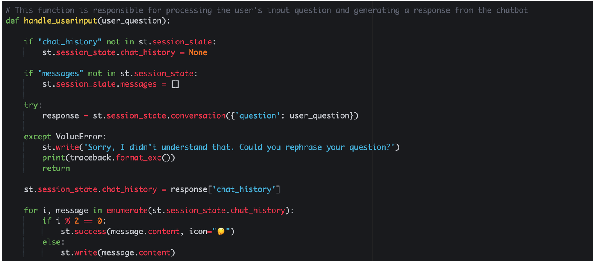

7. Create the Streamlit components

Streamlit is an open-source Python library that makes it simple to create and share beautiful, custom web apps for machine learning and data science. In just a few minutes you can build and deploy powerful data apps.


## Deployment Validation

Ensure there are no errors in your application and each of the steps in the deployment section completed successfully.

## Running the Guidance

Now that you have successfully written code for your generative AI chatbot application, it’s time to run the application via Streamlit.

1. Navigate to the folder source/01_RetrievalAugmentedGeneration/01_QuestionAnswering_Bedrock_LLMs

Run the following command:
```
streamlit run rag_app.py --server.port 8080
```
2. If the command is successful, your output screen will look like below (note: we are using AWS Cloud9 terminal):

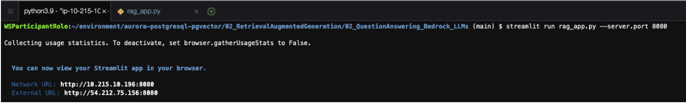

3. In Cloud9, you are able to preview a running application from within the IDE. Choose Preview -> Preview Running Application from the menu bar:

   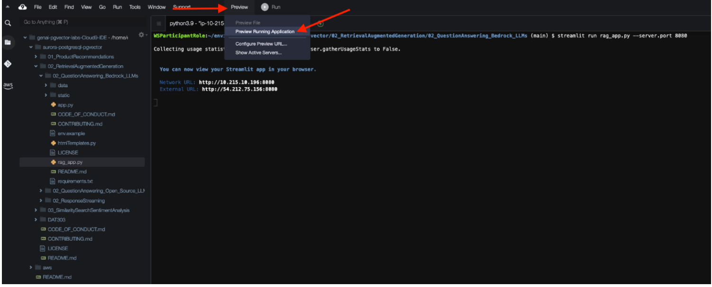

4. The Preview screen appears as follows:

   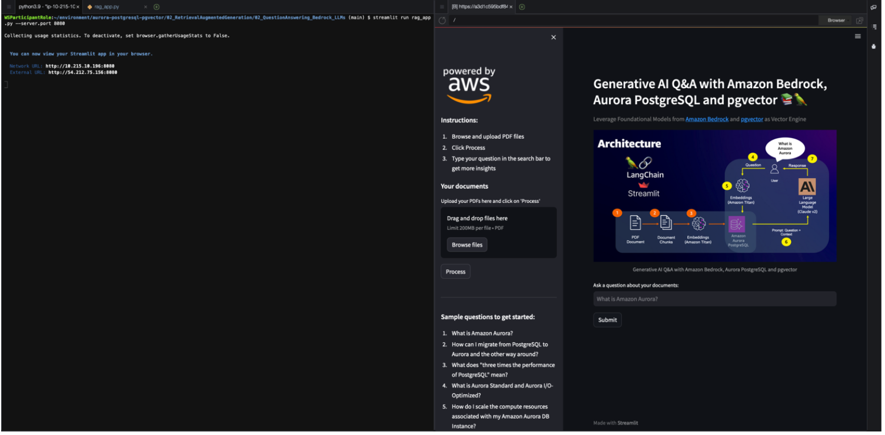

5. Follow the instructions in the sidebar:

    a. Browse and upload PDF files. You can upload multiple PDFs because we set the parameter accept_multiple_files=True for the file_uploader function.
   
    b. Let’s upload a PDF – Amazon Aurora FAQs. Download/save this file and upload it to your Streamlit application by clicking Browse files. Once you’ve uploaded the file, click Process. Once the PDF is uploaded successfully, you will see a PDF uploaded successfully.

   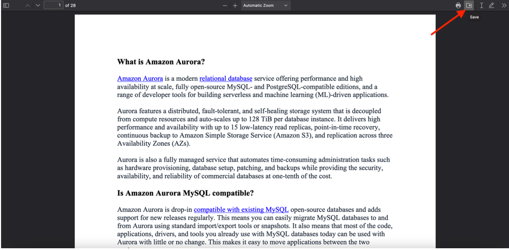

   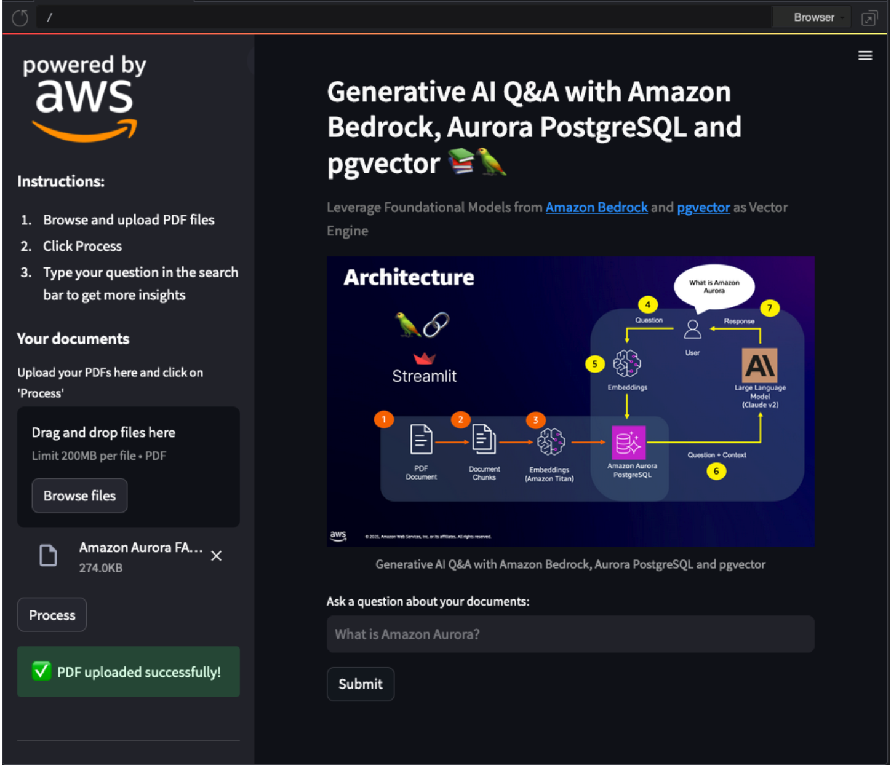

6. Start asking your questions in the text input box. For example, let’s start with a simple question – What is Amazon Aurora?

   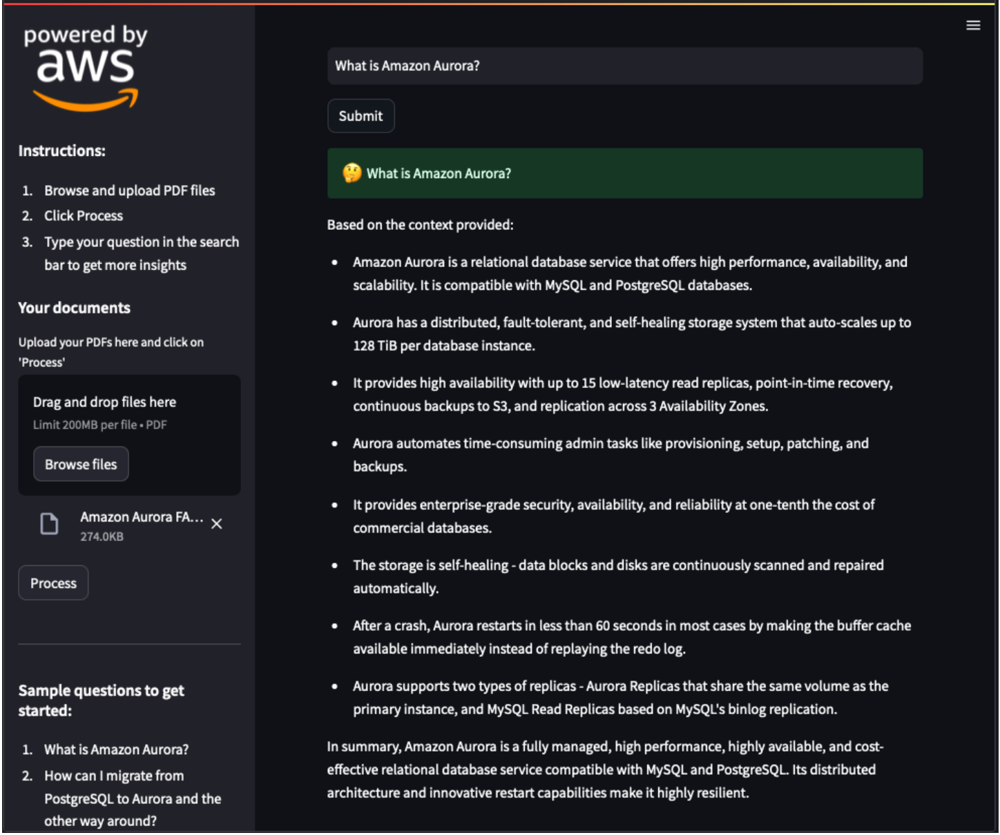

7. Let’s ask a different question, a bit more complex – What does "three times the performance of PostgreSQL" mean?

    > [!Note] 
    > you may either see a similar or a slightly different response:

   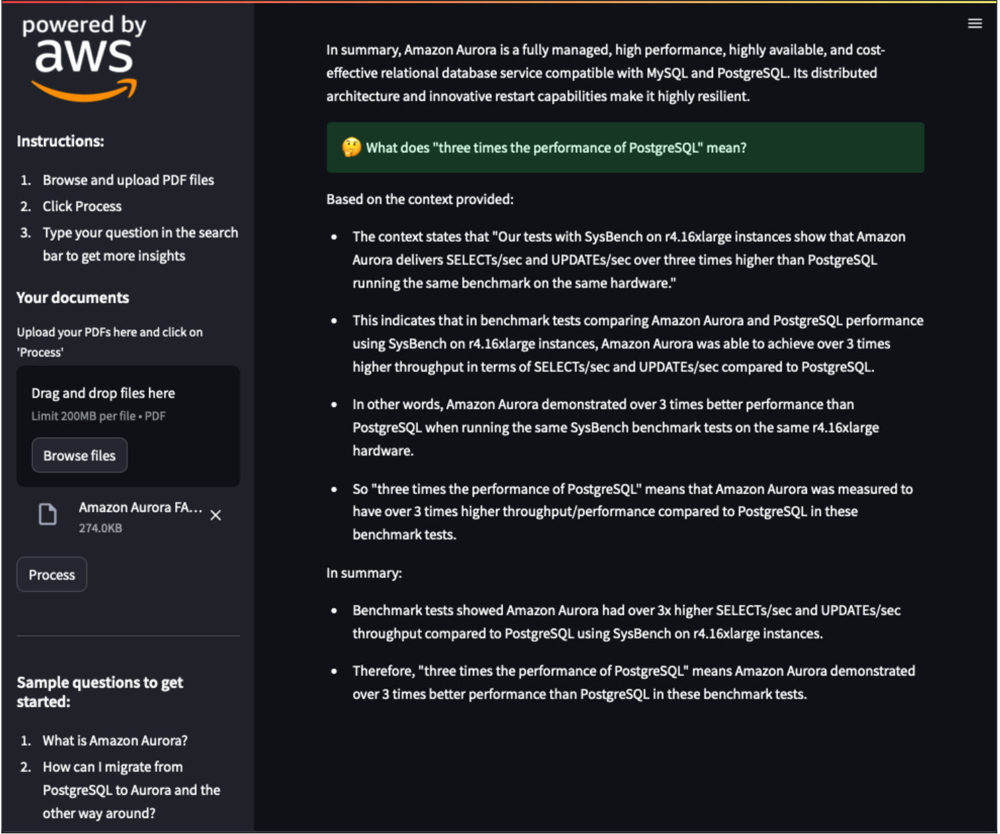

Note here that without specifying the keyword “Aurora”, our generative AI app took the context from the previous question and inferred that the question was in fact about Amazon Aurora PostgreSQL-Compatible Edition. This is because the chat/conversation history is preserved due to LangChain’s ConversationSummaryBufferMemory. Also, ConversationalRetrievalChain allows you to set up a chain with chat history for follow-up questions.

8. With Streamlit, you can also upload multiple files as sources and ask questions from any of those sources. But before we upload our new file, let’s ask a question for which our LLM doesn’t have any context yet – What is Amazon Bedrock?

Note the response (you may either see a similar or a slightly different response):

   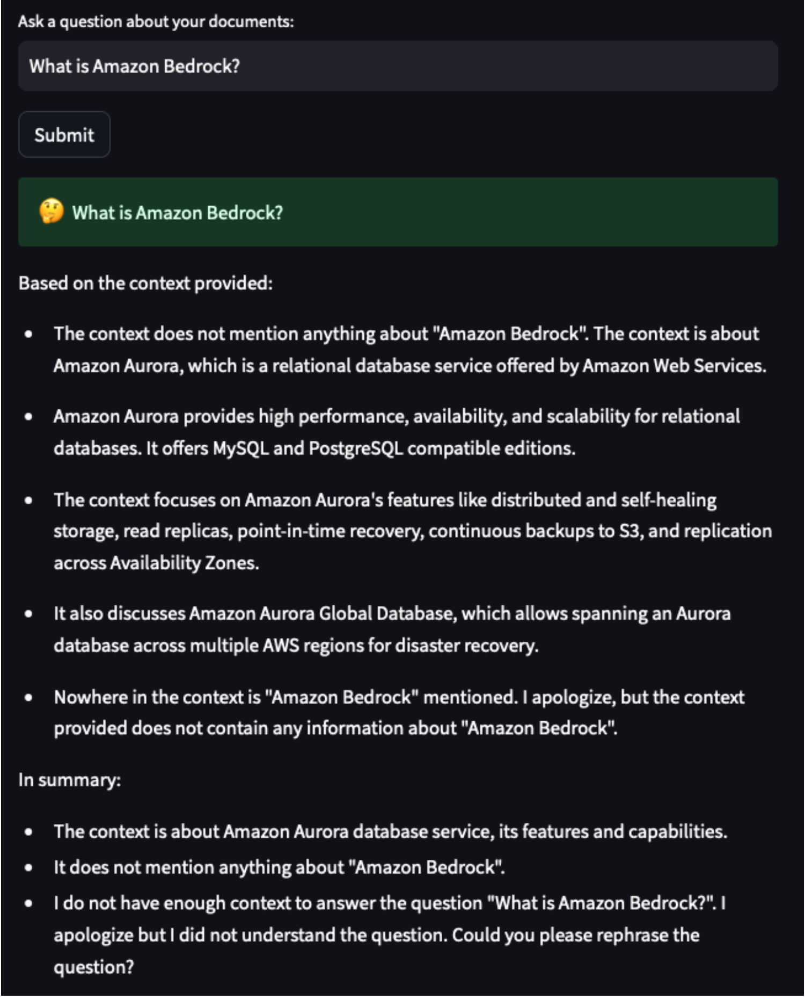

9. Now, let’s upload another file [Amazon Bedrock FAQs](https://ws-assets-prod-iad-r-pdx-f3b3f9f1a7d6a3d0.s3.us-west-2.amazonaws.com/1b65c05a-7ca9-474d-b6a7-4471e489c569/Amazon%20Bedrock%20FAQs.pdf). Download/save this file, click Browse files to upload this file and then click Process. Once the PDF is uploaded successfully, you will see a PDF uploaded successfully

Now, let’s ask our chatbot the previous question. A response similar to the following is generated:

   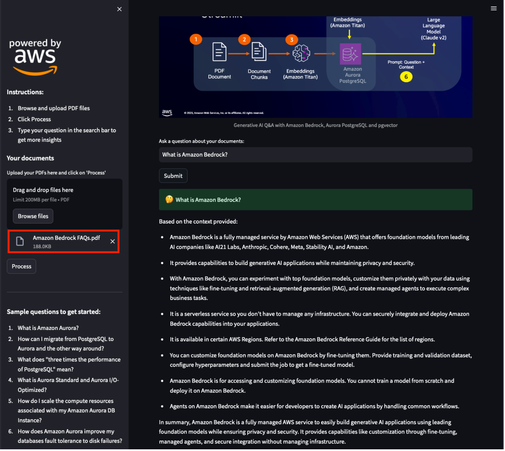
   
10. Try out some more questions and see the results:

        1.Which FMs are available on Amazon Bedrock?

        2.Why should I use Amazon Bedrock?
    
        3.What are agents for Amazon Bedrock?
    
        4.How can I connect FMs to my company data sources?
    
        5.How can I securely use my data to customize FMs available through Amazon Bedrock?

## Next Steps

In this Guidance we are using Amazon Titan text embedding model to generate embeddings. You can also try with other LLM models that are supported on Amazon Bedrock. Refer to these additional blog posts for more details.

[Leverage pgvector and Amazon Aurora PostgreSQL for Natural Language Processing, Chatbots and Sentiment Analysis](https://aws.amazon.com/blogs/database/leverage-pgvector-and-amazon-aurora-postgresql-for-natural-language-processing-chatbots-and-sentiment-analysis/)

[Build generative AI applications with Amazon Aurora and Knowledge Bases for Amazon Bedrock](https://aws.amazon.com/blogs/database/build-generative-ai-applications-with-amazon-aurora-and-knowledge-bases-for-amazon-bedrock/)

## Cleanup

This Guidance requires manual deletion of resources created as part of this guidance. If AWS Cloud9 instance and Amazon Aurora DB Cluster were newly created following the steps per this guidance, then those have to be manually deleted when no longer required. 

## Notices

*Customers are responsible for making their own independent assessment of the information in this Guidance. This Guidance: (a) is for informational purposes only, (b) represents AWS current product offerings and practices, which are subject to change without notice, and (c) does not create any commitments or assurances from AWS and its affiliates, suppliers or licensors. AWS products or services are provided “as is” without warranties, representations, or conditions of any kind, whether express or implied. AWS responsibilities and liabilities to its customers are controlled by AWS agreements, and this Guidance is not part of, nor does it modify, any agreement between AWS and its customers.*

### License

The GenAI Q&A Chatbot with pgvector and Amazon Aurora PostgreSQL-compatible edition application is released under the [MIT-0 License](https://spdx.org/licenses/MIT-0.html).

## Authors
- Shayon Sanyal
- Krishna Sarabu
- Raj Jayakrishnan
- Sharath Chandra Kampili
- Yamuna Palasamudram

### Contribution
This repository is intended for educational purposes and does not accept further contributions. Feel free to utilize and enhance the app based on your own requirements.
    

